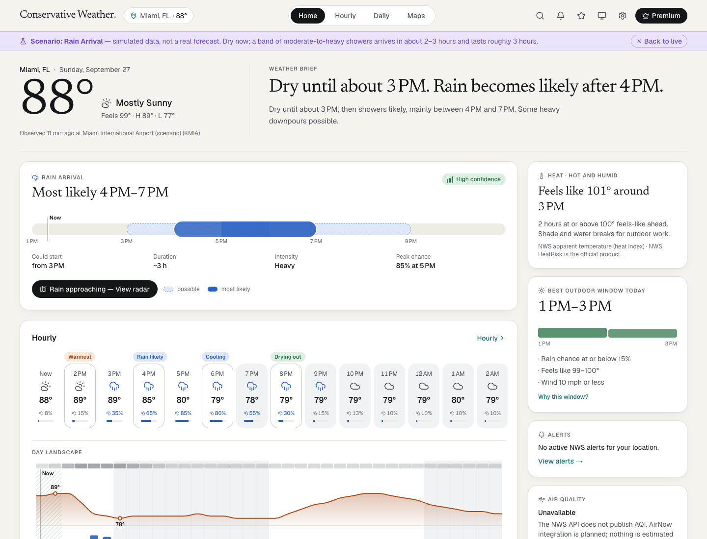
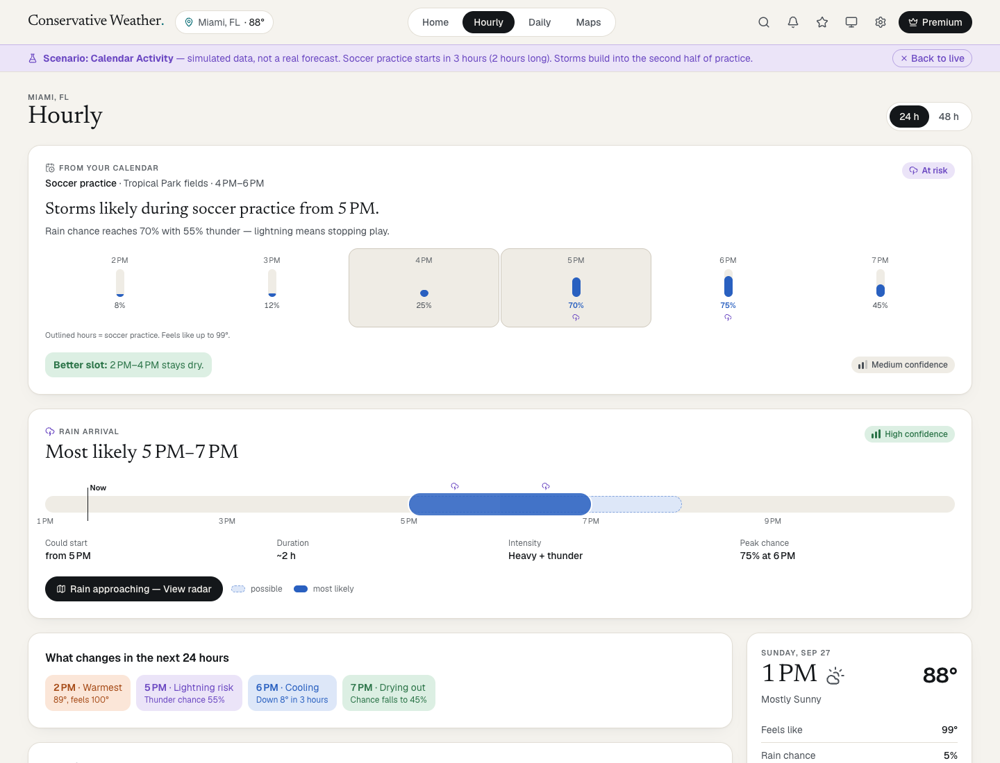
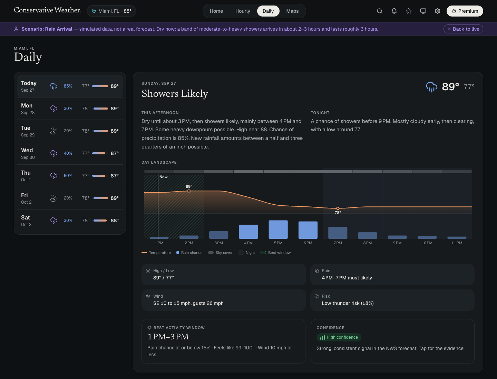
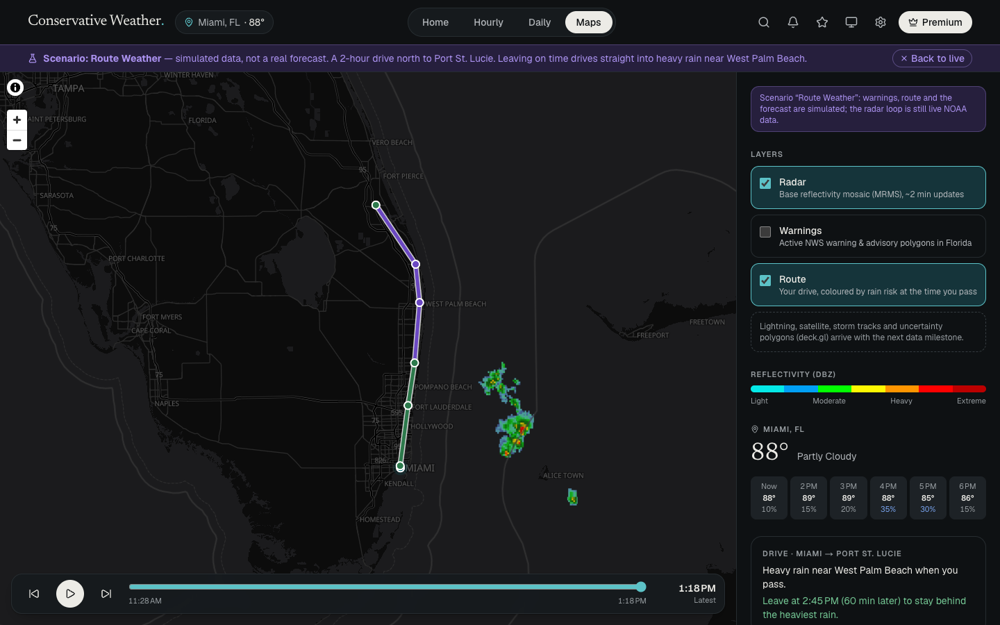
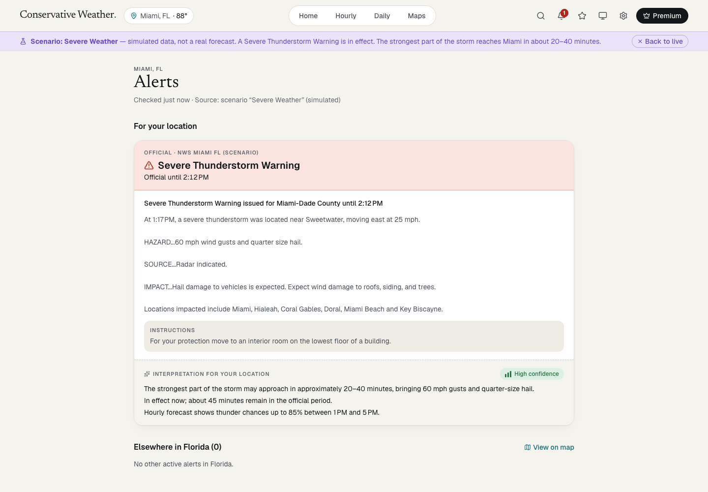

# Conservative Weather — 2050 Web Direction C

Responsive weather web prototype built from [`docs/2050_Web_Conservative_Intelligent_Forecast_PRD.md`](docs/2050_Web_Conservative_Intelligent_Forecast_PRD.md).
Familiar **Home / Hourly / Daily / Maps** structure with an intelligence layer that decides what to say and promote.

- **Live data:** National Weather Service (api.weather.gov) for Miami, FL — hourly, 7-day, gridded data, observations, alerts. Radar: NOAA/NCEP MRMS.
- **Scenarios:** six PRD test cases in `data/scenarios/*.json`, anchored to "now". Switch with `?scenario=calm|rain|severe|calendar|route|uncertain` (or `live`), or from Settings / `/debug`.
- **Stack:** Next.js (App Router) · React · TypeScript · Tailwind · TanStack Query · D3 (Day Landscape, Precip Ribbon) · ECharts · MapLibre GL · Motion.
- **Themes:** System / Light / Dark.

## Screenshots

**Home** — weather brief, rain arrival ribbon with confidence, hourly transitions and the context rail (Rain Arrival scenario, light theme).



**Hourly** — calendar-aware card (soccer practice at risk, with a drier slot), rain arrival ribbon and the highlighted transitions, with the hour inspector on the right (Calendar Activity scenario, light theme).



**Daily** — 7-day list beside the selected day: NWS narrative, Day Landscape, rain timing, wind, risk, best activity window and confidence (Rain Arrival scenario, dark theme).



**Maps** — live NOAA radar with playback, plus the drive to Port St. Lucie coloured by rain risk and a departure suggestion (Route Weather scenario, dark theme).



**Alerts** — the official Severe Thunderstorm Warning text stays authoritative; the interpretation for your location sits separately with its confidence (Severe Weather scenario, light theme).



## Run

```bash
npm install        # postinstall copies the MapLibre ESM build into public/maplibre
npm run dev -- --port 3050
```

Routes: `/`, `/hourly`, `/daily`, `/maps`, `/alerts`, `/debug`.

## Accessibility QA

With the dev server running:

```bash
npm run qa:a11y
```

Runs axe-core (WCAG 2.2 A/AA) over 6 pages × 7 data cases × light/dark × 375/768/1440 px, plus open sheets/drawers, 320 px reflow and a minimum text-size check (uses the locally installed Google Chrome).

## Where things live

- `lib/nws.ts` — NWS fetch + normalization
- `lib/scenario-data.ts` — scenario files → the same data model
- `lib/editorial-rules.ts` — brief, decision modules, card order, confidence, calendar/route/model-spread rules
- `components/weather`, `components/maps` — UI modules
